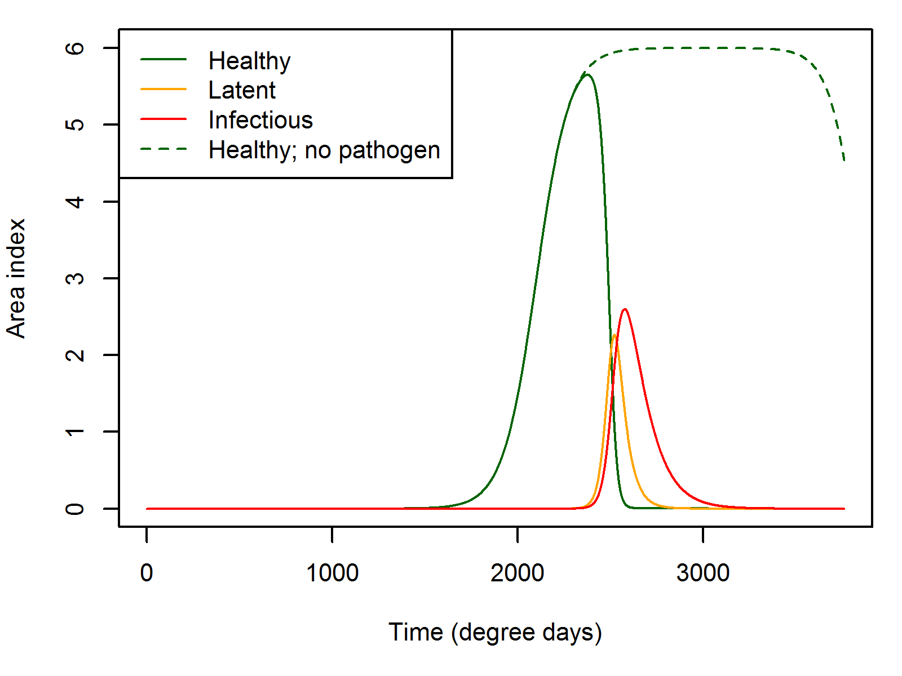
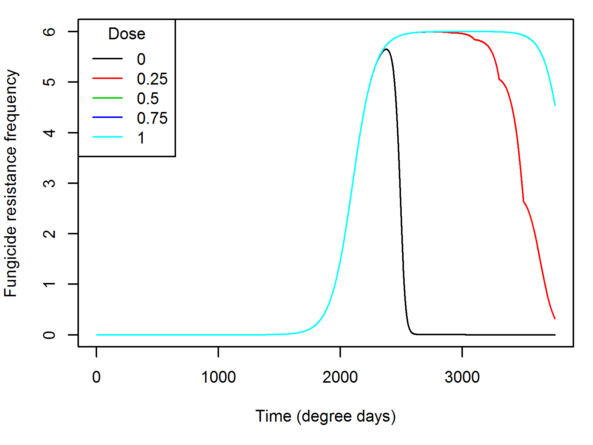
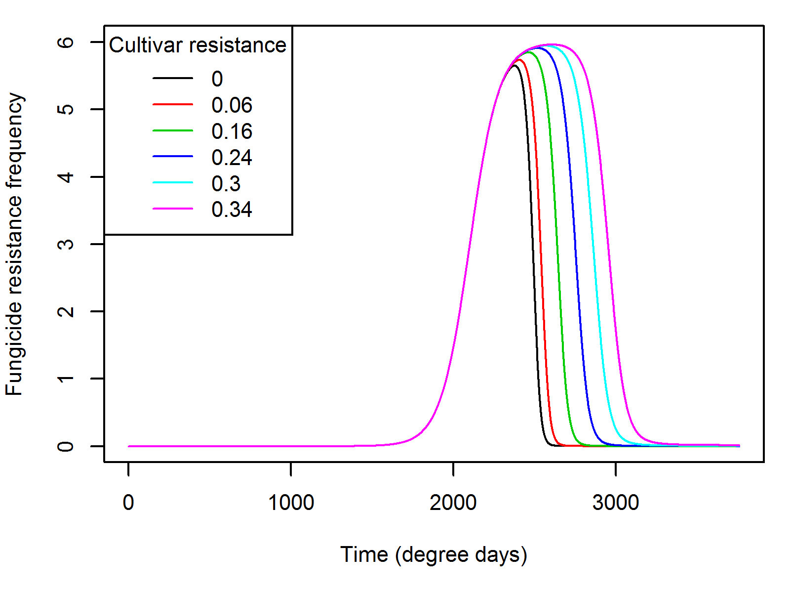
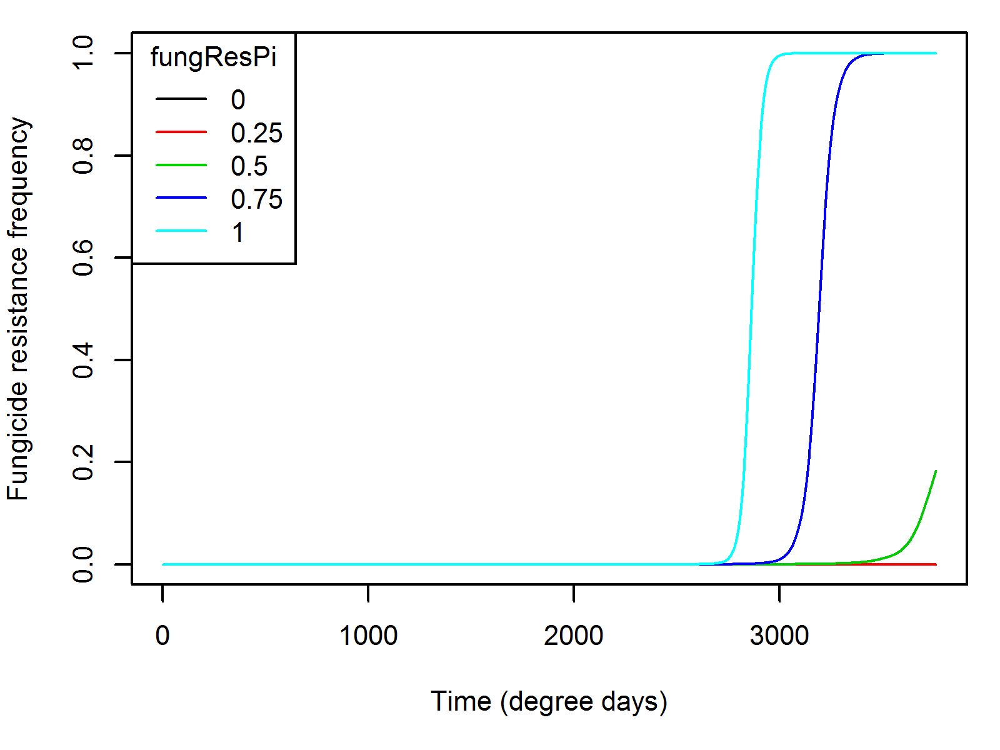
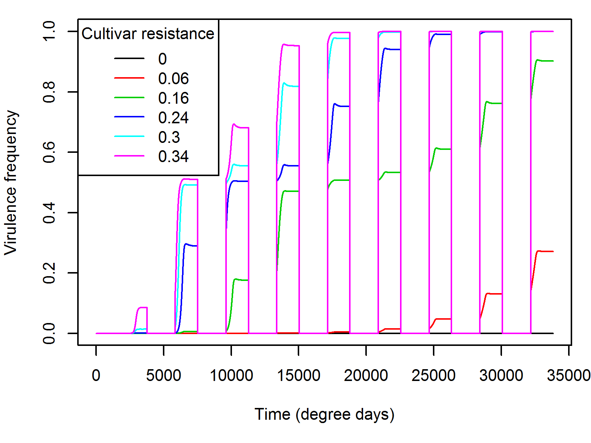

```{r Includes,echo=FALSE,message=FALSE}
require(deSolve)
```

I want to use this document to describe and show the working's of Kevin's model of Phytophthora infestans on potato, cause of potato blight.

The model describes the spread of P. infestans over consecutive years, and allows control by fungicides and cultivar resistance genes. Simultaneously the pathogen has genotypes for fungicide insensitivity and cultivar resistance which may be selected for through the use of these control options.

# Host growth

The host is represented as the crop's area index - the unit area of leaf area per unit area of ground area. The model is described in degree days, and initially grows logistically, before senescing later in the season.

If we assume that the leaf area index (LAI) increases logistically over time, then we can assume that the area index of senesced leaf (SAI) also grows logistically over time, eventually leading to all leaf area becoming senesced.

We therefore explicitly model the LAI and SAI as logistic functions:

$$ LAI = \frac{a}{1+e^{-\frac{t-c}{b}}}$$
$$ SAI = \frac{a}{1+e^{-\frac{t-m}{n}}}$$
where $a$ is the maximum LAI in the absence of senescence, and $b$ and $c$ specify the midpoint of the logistic curve and the slope respectively for the LAI curve, and similarly for $m$ and $n$.

Clearly, the derivative of the healthy area index (H) of the crop in the absence of the pathogen is the result of both growth and senescence.

$$\frac{dH}{dt} = H(g(H) - \omega(H))$$

where $g(H)$ is the growth rate, and $\omega(H)$ defines the senesence rate.

By differentiating LAI we can work out the growth rate and senescence rate per unit leaf area.

$$g(H) = \frac{\frac{a e^{-\frac{(t - c)}{b}}}{b(1 + e^{-\frac{t - c}{b}})(1+e^{-\frac{t-c}{b}})}}{LAI - SAI}$$

Similarly, the senesence rate, $\omega(H)$, is as follows:

$$g(H) = \frac{\frac{a e^{-\frac{(t - m)}{n}}}{n(1 + e^{-\frac{t - m}{n}})(1+e^{-\frac{t-m}{n}})}}{LAI - SAI}$$

The following plots show the results of these derivatives using the parameters that Kevin used in Carolan, 2017 (A0 = H0 = 4.412073e-10,a=6,b=90,c=2100,m=3850,n=80).

```{r HostGrowth,echo=FALSE}

# First set up the derivatives
hostGrowth<-function(t,y,parms){
    
    with(as.list(c(y,parms)),{
        
        # Calculate the explicit LAI
        LAI = a / (1 + exp(-(t - c)/b))
        
        # Calulate the explicit SAI
        SAI = a / (1 + exp(-(t - m)/n))
        
        # Calculate the growth rate
        growthRate = (a * exp(-(t - c)/b)/((b*(1 + exp(-(t - c)/b)))*(1 + exp(-(t - c)/b))))/(LAI - SAI)
        
        # Calculate the senesence rate
        senesRate = (a * (exp(-(t - m)/n))/((n*(1 + exp(-(t - m)/n)))*(1 + exp(-(t - m)/n))))/(LAI - SAI)
        
        dA = A * growthRate
        dH = H * (growthRate - senesRate)
    
        return(list(c(dA,dH)))
    })
    
}

maxTime = 3759
init = c(A = 4.412073e-10,H = 4.412073e-10)
params = c(a=6,b=90,c=2100,m=3850,n=80)

output = as.data.frame(ode(y=init,parms=params,func=hostGrowth,times=seq(0,maxTime)))

par(mar=c(5,4,1,1))
plot(output$A~output$time,type="l",xlab="Time (degree days)",ylab="Area index")
lines(output$H~output$time,lty=2)
legend("topleft",lty=c(1,2),c("Area index","Healthy area index"))

```

Figure 1. Healthy area index over time.

This doesn't look anything like the data found in Gordon, Brown & Dixon, 1997, but admittedly that is from Canada. It does however look similar to the LAI in Jongschahap, 2006.

# Pathogen growth

The pathogen infects the leaves of the crop in a traditional S-L-I-R manner.

## Primary inoculum

The epidemic starts off with an influx of inoculum, $\eta(t)$, which is represented as a normal distribution of spore influx around degree day 2100, the same density each year:

$$\eta = 0.01 e^{-0.5(\frac{t-2100}{50})^2}$$

```{r PrimaryInoc,echo=FALSE}
time = seq(0,maxTime)    
plot(0.01 * exp(-0.5*((time-2100)/50)^2)~time,type="l",xlab="Time (degree days)",ylab="Primary inoculum")
```

Figure 2. Density of primary inoculum over time.

The proportion of these spores that form latent lesions is then the proportion that land on healthy crop - the proportion that land on the crop, $p(t)$, multiplied by the proportion of the crop that is healthy $\frac{H}{A}$ - multiplied by the efficiency $IE$.

The proportion of spores that land on the crop is related to the LAI; the higher the LAI the more spores will be intercepted. $p(t) = (1 - e^{-A})$

The derivative of the latent lesion area index can then be calculated as:

$$\frac{dL}{dt} = \eta (1 - e^{-A}) \frac{H}{A} IE$$

## Secondary transmission

Once latent lesions are infecting the crop they produce spores at a constant sporulation rate, $\sigma$. These spores then infect more healthy leaf tissue, according to the same rules as above:

$$\frac{dL}{dt} = I \sigma (1 - e^{-A}) \frac{H}{A} IE$$

where $I$ is the area index of leaf infected with infectious tissue.

## Life-cycle of lesions

Latent lesions resulting from both primary and secondary inoculum is treated the same. Each has a constant rate of transmission to the infectious stage, $\mu$, defining the latent period. Similarly the infectious lesions have a constant rate of transmission out of the infectious lesions, $\sigma$, defining the infectious period.

## System of equations

$$\frac{dH}{dt} = H(g(H) - \omega(H))$$
$$\frac{dL}{dt} = (\eta + I \sigma) (1 - e^{-A}) \frac{H}{A} IE - \mu L - \omega L$$
$$\frac{dI}{dt} = \mu L - \sigma I - \omega I$$
$$\frac{dR}{dt} = \sigma I + \omega(H+L+I)$$

The above results in the following graph using Kevin's parameters.

```{r Pathogen,echo=FALSE}
# First set up the derivatives
pathogenGrowth<-function(t,y,parms){
    
    with(as.list(c(y,parms)),{
        
        # Host growth:
        # Calculate the explicit LAI
        LAI = a / (1 + exp(-(t - c)/b))
        # Calulate the explicit SAI
        SAI = a / (1 + exp(-(t - m)/n))
        # Calculate the growth rate
        growthRate = (a * exp(-(t - c)/b)/((b*(1 + exp(-(t - c)/b)))*(1 + exp(-(t - c)/b))))/(LAI - SAI)
        # Calculate the senesence rate
        senesRate = (a * (exp(-(t - m)/n))/((n*(1 + exp(-(t - m)/n)))*(1 + exp(-(t - m)/n))))/(LAI - SAI)
        dA = A * growthRate
        dH = H * (growthRate - senesRate)
        
        # Primary spore influx:
        primaryInoc = 0.01 * exp(-0.5 * ((t - 2100)/50)^2)
        
        # Calculate derivative of new latent lesions
        derivNewLL = (primaryInoc + sR * I) * (1 - exp(-A)) * (H/A) * IE
        # Adjust healthy area growth:
        dH = dH - derivNewLL
        # Derivative of latent period:
        dL = derivNewLL - mu * L - senesRate * L
        # Derivative of infectious period
        dI = mu * L - sigma * I - senesRate * I
        dR = sigma * I + senesRate * (H + L + I)
        
        return(list(c(dA,dH,dL,dI,dR)))
    })
    
}

maxTime = 3759
init = c(A = 4.412073e-10,H = 4.412073e-10,L=0,I=0,R=0)
params = c(a=6,b=90,c=2100,m=3850,n=80,sR=8,IE=0.01655833,mu=1/50.66542,sigma=1/102)

output = as.data.frame(ode(y=init,parms=params,func=pathogenGrowth,times=seq(0,maxTime)))

par(mar=c(5,4,1,1))
plot(output$A~output$time,type="l",xlab="Time (degree days)",ylab="Area index")
lines(output$H~output$time,col="darkgreen")
lines(output$L~output$time,col="orange")
lines(output$I~output$time,col="red")
lines(output$R~output$time,col="gray")
legend("topleft",c("Area index","Healthy area index","Latent","Infectious","Removed"),col=c(1,"darkgreen","orange","red","gray"),lty=1)
    
```

Figure 3. Pathogen in the absence of control basically destroys the crop.

# Control options

There are two control options considered in this model: cultivar resistance and fungicides.

## Cultivar resistance

One of the main control methods avaiable to farmers is cultivar resistance. Resistance to Phytophthora infestans is generally

Cultivars are given a resistance rating on a scale of 1:9, where 1 is highly susceptible and 9 is highly resistant to the pathogen.

* Need info here on the mechanisms of resistance

In the model, we represent cultivar resistance as decreasing the infection efficiency, sporulation rate and increasing the latent period to the same degree. That is, if a cultivar has a single QTL resulting in resistance, we specify that this decreases the infection efficiency and sporulation rate by a proportion, $1-\theta$, where $\theta = 1$ is complete resistance and $\theta = 0$ is fully susceptible, while increasing the latent period by (1 + $1-\theta$).

With one QTL the infection efficiency may be calculated as: $IE = IE_0 (1 - \theta)$. With more than one QTL, the reduction in infection efficiency is calculated as the product of the reduction of each of the QTLs: $IE = IE_0 \prod_i (1 - \theta_i)$.

In this way, the more QTLs conferring resistance the cultivar has, or the greater the $\theta$, the lower the rate of increase of the pathogen:

```{r cultivarResistance,echo=FALSE}

IE = params[["IE"]]
theta = 0.1
plot(IE * (1-theta)^seq(0,10)~seq(0,10),xlab="Number of QTLs",ylab="Infection efficiency",type="o",ylim=c(0,IE))
theta = 0.5
lines(IE * (1-theta)^seq(0,10)~seq(0,10),type="o",pch=2,lty=2)
theta = 0.9
lines(IE * (1-theta)^seq(0,10)~seq(0,10),type="o",pch=3,lty=3)
legend("topright",title="Theta:",legend=c(0.1,0.5,0.9),lty=1:3,pch=1:3)

```

Figure 4. Reduction in the infection efficiency as resistance is increased or the number of QTLs with $\theta = 0.5$ is increased.

The number of resistance genes in the model is the same as the number of virulence genes. That is, we assume that there is a single virulence gene against each resistance gene. Each resistance gene is assumed to reduce the life-history parameters by the same amount.

## Fungicide

The other main control option is the application of pesticides. As with previous papers, we model the effect of a single pesticide by decreasing the life-history parameters of the fungus according to the dose:
$IE = IE_0(1 - \alpha_{Max}(1 - exp(-\beta D)))$
where $\alpha_{Max}$ denotes the maximum reduction in the life-history parameter at infinite dose of fungicide, and $\beta$ specifies the slope of the dose-response curve.
With multiple fungicides, we simply multiply the effects, such that:
$IE = IE_0 f(D_1) f(D_2)$

```{r singleFungicide,echo=FALSE}
par(mfrow=c(1,2),mar=c(5,4,1,1))

# First plot a single fungicide
a_max = c(0.8,0.5)
beta = c(5,2)
dose = seq(0,1,0.01)
plot(IE * (1 - a_max[1]*(1 - exp(-beta[1] * dose)))~dose,type="l",xlab="Fungicide dose",ylab="Infection efficiency",ylim=c(0,IE))
lines(IE * (1 - a_max[2]*(1 - exp(-beta[2] * dose)))~dose,lty=2)
legend("topright",lty=c(1,2),c("a_Max=0.8,beta=5","a_Max=0.5,beta=2"))
# Then plot two fungicides combined
plot(IE * (1 - a_max[1]*(1 - exp(-beta[1] * dose)))*(1 - a_max[2]*(1 - exp(-beta[2] * dose)))~dose,type="l",xlab="Fungicide dose",ylab="Infection efficiency",ylim=c(0,IE))

```

Figure 5. On the left the dose-response curves of two fungicides with different parameters. On the right the dose-response curve of a mixture of those fungicides on the left, with each sprayed at the same dose.

# Resistance

With control options comes selection for resistance against that control. Here, as we are modelling cultivar resistance and fungicides we consider selection for virulence and fungicide insensitivity respectively.

In order to model these we calculate the area index of each individual genotype over time. If we specify that we want to model a single virulence gene, we therefore have three genotypes to model: AA, AV, and VV, where A represents an avirulence allele and V represents a virulent allele. The model then contains of 6 state variables for the pathogen: $L_{AA}$, $L_{AV}$, $L_{VV}$, $I_{AA}$, $I_{AV}$, $I_{VV}$, for the latent and infectious lesions of each genotype.

Adding more virulence genes ($N_V$) or fungicide insensitivity ($N_I$) genes increases the number of genotypes according to $3^{N_V+N_I}$.

As shown below, while virulence results in complete bypassing of the resistance gene, fungicide insensitivity is only a partial escape from the fungicide.

## Effect of virulence

A virulent pathogen results in the pathogen bypassing the resistance gene - the resistance gene can no longer recognise the pathogen effector.

With a single resistance gene, the life-cycle parameters are reduced (or increased in the case of the latent period) by $(1-\theta)$. If the pathogen is virulent however, we assume no reduction in the life-history parameters.

### Fitness costs of virulence

While virulence results in a benefit on a resistant cultivar, on a susceptible cultivar a virulent pathogen often has a cost. The model therefore includes a fitness cost for a pathogen with a virulence allele: $\zeta$.

## Effect of fungicide insensitivity

Fungicide insensitivity results in the fungicide having less of an effect. While absolute insensitivity means that a fungicide will have no effect on an insensitive pathogen, most pathogens are only partially insensitive. We model this by allowing a fungicide insensitivity gene to change the level of the asymptote of the dose-response curve. With a parameter, $\phi$, if $\phi = 1$ the pathogen is completely insensitive to the fungicide, whereas if $\phi = 0$ the insensitivity gene has no effect and the fungicide is as effective as if it were the sensitive pathogen strain. 

$$IE = IE_0 (1 - \alpha_{Max}) (1 - \phi) (1 - e^{-\beta D})$$

```{r FungicideInsensitivity, echo=FALSE}

plot(IE * (1 - a_max[1] * (1 - 0.0) * (1 - exp(-beta[1] * dose)))~dose,type="l",ylim=c(0,IE),xlab="Dose",ylab="Infection efficiency")
lines(IE * (1 - a_max[1] * (1 - 0.5) * (1 - exp(-beta[1] * dose)))~dose,col=2)
lines(IE * (1 - a_max[1] * (1 - 1) * (1 - exp(-beta[1] * dose)))~dose,col=3)
legend("bottomleft",lty=1,col=1:3,legend=paste(c(0.0,0.5,1.0)),title="Phi:")
```

Figure 6. Effect of the fungicide resistance genes.

### Fitness cost of fungicide insensitivity

There is also fitness costs of fungicide insensitivity, $\eta$.

## Mutation

Mutation happens.

# Simulation with Kevin's parameters

The following graphs show what happens with Kevin's parameters using Kevin's C++ model (with my corrections). These parameters are summarised in the table here:

|**Parameter**|**Description**|**Value**|
|------|------------------------------------|------|
||**Crop parameters**||
|a|Maximum area index|6|
|b|Slope of crop growth|90|
|c|Mid-point of crop growth|2100|
|m|Mid-point of crop senesence|3850|
|n|Slope of crop senesence|80|
|H0|Initial area index of crop|4e-10|
||**Pathogen parameters**||
|$\mu$|Latent period|50.66542|
|$\sigma$|Infectious period|102|
|SR|Sporulation rate|8|
|IE|Infection efficiency|0.01655833|
||**Control parameters**||
|$\alpha_{Max}$|Asymptote of dose-response curve|1.0|
|$\beta$|Slope of dose-response curve|5|
|$\theta$|Proportional reduction due to a single resistance gene|Variable (see below)|
||Fungicide decay rate|0.007967209|
||**Resistance parameters**||
||Mutation rate|0.000001|
|fungResPi|Proportional reduction in $\alpha_{Max}$|0.5|
|$\zeta$|Fitness cost of being virulent|0.002|
|$\eta$|Fitness cost of fungicide insensitivity|0.002|
||Dominance (of all traits)|0.5|

## Default epidemic

As previously shown (and below) in the absence of any control options, the pathogen destroys the crop. I believe this is what Kevin expects (the extent of the destruction is not well fitted I believe).

{ width=50% }

## Epidemic and control

The use of fungicides and cultivar resistance is assumed to control the pathogen and lead to a large increase in HAD, and therefore yield.

Clearly, the fungicide dose response curves are currently wrong.

{ width=50% }

Kevin had found five values for the reduction of an avirulent pathogen on a resistant crop, purportedly relating to cultivar resistance ratings.

|Cultivar resistance rating|Proportional reduction in life-history parameters|
|--|--|
|3|0.06|
|4|0.16|
|5|0.24|
|6|0.3|
|7|0.34|

{ width=50% }

## Selection

I'm pretty sure the parameters for selection were made up. We have two main parameters to consider: 1) how much fungicide insensitivity reduces the effect of a fungicide, and 2) how much a virulence gene reduces the effect of a cultivar resistance gene. We are, as with all things here, assuming that any multiples of the cultivar resistance genes, fungicides, fungicide insensitivity genes, and virulence genes have the same effect.

Looking at fungicide insensitivity, if the insensitivity reduces the effect of the fungicide by 75%, we get total insensitivity within a single year, which probably shouldn't be allowed.

{ width=50% }

Under each of the resistant cultivars, we can look and see how fast selection leads to resistance.

{ width=50% }